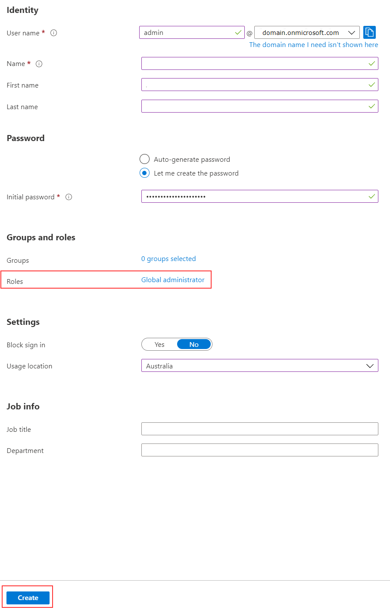

# Instructions
1. Go to https://azure.microsoft.com/free
2. Create a free Azure account.
3. Login and navigate to https://portal.azure.com
4. Click on the `Azure Active Directory` blade.
5. Click on `Licenses` > `All Products`
6. Click `+ Try / Buy`
7. Sign up for the Enterprise Mobility and Security E5 trial.
   1. You will get 250 licenses for 90 days.
   2. This includes Azure AD Premium P2, which is necessary for a lot of the Azure labs.
8. Go to the Users blade in Azure Active Directory and add a new user, with the following settings:

9.  Download the .zip file from the Releases page and extract to a folder of your choice.
10.  Open a PowerShell window as admin and set your PowerShell directory to be the same location as where you chose to extract to (the JSON folder should be visible but not the contents of).
11.  Run the .ps1 script and enter in requested information, using the account you just created.
12.  You should now have an Azure tenancy with 250 test users plus your admin Global Administrator.